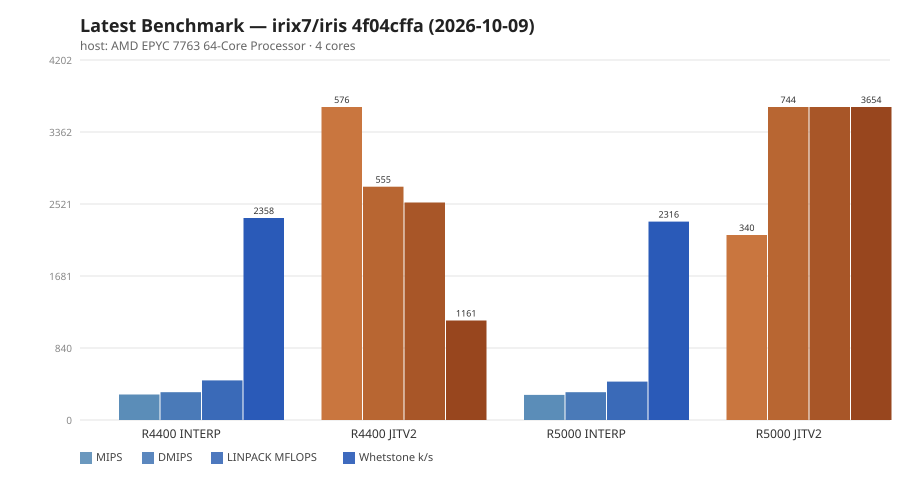

Me and my homies Claude and Gemini present:


# IRIS — Irresponsible Rust IRIX Simulator

An SGI Indy / Indigo2 emulator, vibed into existence with Rust and AI assistance.
Boots IRIX 6.5 and 5.3. Has networking. Has a framebuffer.


**Status snapshot:**

- **Indy IP24** — primary daily-driver; IRIX desktop, X11, networking all work.
  R4400 (default) or R5000, picked at runtime.
- **Indigo2 IP22** — embedded PROM fallback, two SCSI controllers, and the
  fullhouse interrupt layout. Choose Newport XL, GR2 XZ/Extreme, or IMPACT
  graphics; GR2 and IMPACT use command interpreters and software rasterizers
  (see [Indigo2 IP22](docs/indigo2-ip22.md)).
- **Indigo2 IMPACT IP28** — R10000 CPU and IMPACT graphics, with IRIX 6.5
  booting to the desktop. Requires your own IP28 PROM; there is no embedded
  fallback. Two 512 MB banks provide 1 GB of RAM
  (see [Indigo2 IP28](docs/indigo2-ip28.md)).

Prebuilt releases are available in [GitHub Releases](https://github.com/techomancer/iris/releases).

## About this fork

This repository (`irix7/iris`) is a fork of
[`techomancer/iris`](https://github.com/techomancer/iris) — the upstream SGI
Indy / Indigo2 emulator, and the source of the prebuilt releases linked above.
Upstream remains the canonical project.

This fork is a working tree for two things: **performance** (allocator, PGO and
`target-cpu` build defaults; interpreter/JIT dispatch; idle-parking and
device-thread polling; RAM access, SCSI/DMA and NAT hot paths) and **running
IRIS as several parallel per-task instances** for development. The first
upstream-facing change of the latter kind is the CI copy-on-write overlay
relocation (`IRIS_COW_OVERLAY_DIR`). Changes are kept in the shape of upstream
commits so they can be offered back rather than diverging.

Instance mode is landing in stages under the epic
[**Parallel instance fleet**](https://github.com/irix7/iris/issues/1) (tickets
#2–#21). The `--instance` flags and the two isolation seams are in; see
[docs/parallel-instances.md](docs/parallel-instances.md) for the model, the
derivation table, and what is still open.

To pull upstream changes:

```sh
git remote add upstream https://github.com/techomancer/iris   # once
git fetch upstream
git merge upstream/main
```

## Q&A

**Q: What is it?**

**A:** An SGI Indy / Indigo2 emulator with runtime-selectable R4400, R5000,
or R10000 CPUs. Emulates enough hardware that IRIX
boots to a usable system: shell, networking, X11, the works.

**Q: But why?**

**A:** Wanted to see how far vibe coding could go, and to learn some Rust along the way.

**Q: You could have improved MAME.**

**A:** Didn't seem like fun.

**Q: So did you learn Rust?**

**A:** LOL, my brain hurts. Let's not get ahead of ourselves.

**Q: What LLMs did you use?**

**A:** Mostly Claude, some Gemini. They wrote a lot of the hard parts. (This was written by Claude, the humble AI assistant).

**Q: Can I contribute?**

**A:** Yes, bug reports and merge requests are welcome.

**Q: Regrets?**

**A:** Yes.


## Current status

- IRIX 6.5 boots to multiuser, networking works (ping, telnet, ftp, rsh, NFS, XDMCP)
- IRIX 5.3 works too
- **Indy IP24:** X11 / Newport (REX3) graphics works, with mouse and keyboard input
  (IntelliMouse wheel included), HAL2 audio, and IndyCam video-in through VINO
- **Indigo2 IP22:** Newport, GR2 XZ/Extreme, and IMPACT graphics; two SCSI controllers
- **Indigo2 IP28:** R10000, IMPACT graphics, and up to 1 GB with two 512 MB banks
- R4400, R5000, or R10000 CPU, selected per machine at runtime
- Cranelift JIT compiler for MIPS to host code (`jitv2`, optional, experimental),
  plus a REX3 draw pipeline of 400+ precompiled specialised draw functions and an
  optional REX3 shader JIT (`rex-jit`)
- Copy-on-write disk overlay, and CHD images with MAME-style `.diff.chd` sidecars.
  Crash all day, base image stays clean
- Hot-swappable CD-ROM with runtime disc switching
- Snapshots: save, restore, in-memory rollback, content-addressed dedup, HTTP push/pull
- Built-in NAT gateway with DHCP, host-DNS forwarding, port forwarding, an
  in-process NFSv2/v3 server, TFTP for PROM network boot, and FTP/XDMCP helpers;
  or PCAP bridging onto a real LAN
- Headless mode and a CI control socket (`iris-ci`) for automation
- Optional egui front-end (`iris-gui`) with machine management and a benchmark tab
- DaynaPort SCSI/Link Ethernet and the N64 development board (Ultra64), both enabled per machine in the config
- Other guests: Linux (Debian 7, Gentoo), NetBSD and OpenBSD have had SCSI,
  interrupt and timer fixes land for them. They are not regularly tested, so
  expect rough edges


## Getting started

Download Windows, macOS, and Linux builds from
[techomancer/iris releases](https://github.com/techomancer/iris/releases).
The CLI and iris-gui are developed in this repository. Dani Sarfati contributed
the GUI and its Mac App Store distribution support.

You need:

- A hard-disk image with IRIX 6.5.22 (or 5.3) for Indy. To produce one, follow
  [rules/irix/irix-install.md](rules/irix/irix-install.md) (install from the
  original media CDs into an empty CHD/raw disk).
- `070-9101-011.bin` — Indy PROM image (optional; a default is embedded, and so
  is an Indigo2 one)

Now, if you feel like typing some commands in console. Sync the project and:

```
cargo run --release
```

The project pins a nightly toolchain (`rust-toolchain.toml`); rustup picks it up
automatically.

For the complete core/GUI build-feature lists, configuration keys, CLI
options, defaults, conflicts, and environment controls, see
[FEATURES.md](FEATURES.md). It also contains build examples, CPU details,
and JIT implementation notes. The GUI tour is in
[iris-gui-README.md](iris-gui-README.md); Windows/WSL launch guidance is in
[wsl/README.md](wsl/README.md).

See [CHANGELOG.md](CHANGELOG.md) for dated changes and [TODO.md](TODO.md) for
the feature-completion backlog; the original scratch list is preserved in
[TODO_archive.md](TODO_archive.md).


## Documentation

Start with **[FEATURES.md](FEATURES.md)** for the complete build-feature and
configuration inventory for both `iris` and `iris-gui`.

| Guide | Contents |
|---|---|
| [HELP.md](HELP.md) | CLI usage, TOML examples, monitor commands, serial access, and guest setup. |
| [iris-gui-README.md](iris-gui-README.md) | GUI build, machine management, input, disks, networking, benchmarks, and distribution. |
| [FEATURES.md](FEATURES.md) | All build features, profiles, configuration keys, CLI switches, GUI settings, diagnostic environment controls, CPU specifications, and JIT behavior. |
| [NETWORKING.md](NETWORKING.md) | PCAP bridging and DaynaPort setup; [DaynaPort protocol](docs/daynaport.md) and [XDMCP](docs/xdmcp.md) provide implementation and remote-display detail. |
| [STORAGE.md](STORAGE.md) | CHD, overlays, snapshots, CI automation, and scratch-volume file transfer. |
| [docs/parallel-instances.md](docs/parallel-instances.md) | Running several VMs side by side: the `--instance` flags, the `StatePaths` / `derive_instance` seam, and the epic #1 ticket map. |
| [TESTING.md](TESTING.md) | Rust and guest tests, benchmark commands, CPU matrices, and performance methodology. |
| [CHANGELOG.md](CHANGELOG.md) | Dated repository changes. |
| [TODO.md](TODO.md) / [TODO_archive.md](TODO_archive.md) | Current feature-completion backlog and the original scratch list. |
| [wsl/README.md](wsl/README.md) | Windows/WSL build, launch, and troubleshooting. |
| [PRIVACY.md](PRIVACY.md) | Privacy policy; [App Store review notes](docs/appstore-review-response.md) describe distribution constraints. |

Hardware, testing, and development references:

| Area | Documentation |
|---|---|
| Machine profiles | [Indigo2 IP22](docs/indigo2-ip22.md), [Indigo2 IMPACT IP28](docs/indigo2-ip28.md), and [GR2 XZ/Extreme](docs/indy-xz-elan.md). |
| Graphics and peripherals | [REX3](docs/rex3.md), [HAL2 audio](docs/hal2.md), [WD33C93A SCSI](docs/wd33c93a.md), [interrupt map](docs/interrupt_map.md), and [Ultra64](docs/ultra64.md) / [N64 GIO specifications](docs/n64_gio_specs.md). |
| CPU test suite | [Suite README](cpu-tests/README.md), [current status](cpu-tests/docs/status.md), [findings](cpu-tests/docs/findings.md), [gotchas](cpu-tests/docs/gotchas.md), and [emulator support](docs/cpu-test-support.md). |
| CPU test infrastructure | [Toolchain](cpu-tests/docs/toolchain.md), [memory map](cpu-tests/docs/memory-map.md), [oracle overview](cpu-tests/docs/oracle.md), [hardware oracle](cpu-tests/oracle/README.md), [R4600 notes](cpu-tests/docs/r4600.md), and [original test plan](cpu-tests/PLAN.md). |
| Benchmarks and memory tests | [Benchmark suite](bench/README.md), [prebuilt assets](bench/prebuilt/README.md), [reference results](data/bench_reference.README.md), [GUI benchmark design](docs/gui-benchmark-plan.md), and [memory stress utility](test/memstress/README.md). |
| Architecture and debugging | [HACKING.md](HACKING.md), [runtime debugging](debug.md), [CPU debug notes](src/debug.md), [contributor instructions](CLAUDE.md), and the [rules/](rules/) folder. |
| Memory and JIT design | [Persistent JIT cache](docs/jitv2-persistent-cache.md), [inline memory](docs/jit-inline-memory.md), [JIT performance analysis](docs/jitv2_performance_analysis.md), [physical RAM](docs/ppmem-design.md), [transparent cache](docs/tcache-design.md), and [historical TLB design](docs/nutlb-design.md). |
| Networking and storage designs | [CHD sync](docs/cow-chd-sync-plan.md), [NFS server](docs/nfsudp-plan.md), [networking GUI](docs/networking-tab-redesign.md), [DaynaPort implementation plan](docs/iris-daynaport-target.md), and [PCAP distribution plan](docs/pcap-release-plan.md). These documents retain design history; read their status notes first. |
| HostGL tooling | [Khronos ABI registry tooling](iris-hostgl/tools/khronos/README.md). |

### CHD image support

CHD hard disks and CD-ROMs mount directly. Compressed parents stay untouched;
writes use MAME-style diff sidecars. See [STORAGE.md](STORAGE.md#chd-image-support)
for the backend/licensing details and [HELP.md](HELP.md) for disk preparation.

### PCAP bridged networking (`--features pcap`)

PCAP places the guest on a physical LAN through a host capture interface.
Library/driver requirements, permissions, licensing, setup, and caveats are in
[NETWORKING.md](NETWORKING.md#pcap-bridged-networking---features-pcap).

### DaynaPort SCSI/Link

The SCSI Ethernet adapter is built in and attached per machine. See
[NETWORKING.md](NETWORKING.md#daynaport-scsilink) for its configuration,
driver links, and network isolation requirements.

### Emulated CPU

R4400, R5000, and R10000 are selected at runtime. The specifications,
configuration examples, performance context, and snapshot compatibility rules
are in [FEATURES.md](FEATURES.md#emulated-cpu).

### JIT compilers

Optional `jitv2` compiles MIPS code; `rex-jit` compiles Newport draw shaders
alongside the precompiled drawing routines. See
[FEATURES.md](FEATURES.md#jit-compilers) for their behavior, defaults,
limitations, persistent caches, and corpus-measurement tools.

### Copy-on-write disk overlay

Overlay modes keep base images clean while the guest writes. Configuration,
commit/discard behavior, and CHD sidecar rules are in
[STORAGE.md](STORAGE.md#copy-on-write-disk-overlay).

### Snapshots and rollback

Save/restore, rollback, deduplication, and HTTP snapshot transfer are documented
in [STORAGE.md](STORAGE.md#snapshots-and-rollback). GR2/IMPACT snapshot coverage
is incomplete; that guide states the limits.

### CI control socket and `iris-ci`

Use [STORAGE.md](STORAGE.md#ci-control-socket-and-iris-ci) for Unix/TCP setup,
commands, serial capture, and scripts. `--ci` keeps offscreen graphics alive
unless `--headless` is explicitly selected.

### Parallel instances (`--instance`)

Run several VMs from one host with `--instance N` (ids are 0-based). Each id
derives a private state directory (`iris-instance-{N}`, overridable with
`--state-dir`), a port block from `--port-base` (default `9000 + N*10`, clear
of the legacy 8880/8881/8888 defaults), a CI socket, a stable guest MAC and a
distinct NAT `/24`:

```sh
iris --instance 0 --ci &             # first VM, CI socket under ./iris-instance-0
iris --instance 1 --ci &             # second VM, no port or socket clash
iris --instance 2 --print-instance   # print the derived endpoints and exit
```

Today the derivation applies NVRAM/EEPROM paths, the monitor/serial/CI ports,
the CI socket, the MAC and the NAT subnet. Wiring the remaining artefacts
(snapshot store, COW/CHD overlays, JIT cache, logs and the test dump) under the
state directory, plus a fleet launcher and serial session isolation, are the
open tickets in [docs/parallel-instances.md](docs/parallel-instances.md). With
no instance flag nothing changes, and there is deliberately **one VM per
process**.

### Scratch volume — file injection without networking

Host-to-guest file transfer through a raw scratch disk is described in
[STORAGE.md](STORAGE.md#scratch-volume--file-injection-without-networking).

### Input

Click the window to grab mouse and keyboard. In the `iris` window Right Ctrl
releases the grab (on macOS Right Cmd does too, since Mac keyboards have no
Right Ctrl); in `iris-gui` it is Ctrl+Alt (Option+Command on macOS), with
Ctrl+Alt+Esc as a fallback. When the window loses focus, keys and mouse
buttons still held in the guest are released. Mouse and keyboard use standard PS/2 emulation
through the IOC, including an IntelliMouse scroll wheel. Keys are sent by
physical position, so set IRIX's `keybd` to your layout.

**Note:** Alt-tabbing away from the window can garble keyboard input in IRIX
terminal apps. Use `telnet 127.0.0.1 2323` (with port forwarding configured)
for a clean terminal instead.


### Testing and benchmarking

See [TESTING.md](TESTING.md) for Rust tests, bare-metal CPU/benchmark suites,
matrix runs, reference hardware, and performance methodology.

### Rules

The [rules/](rules/) folder records debugging lessons and subsystem design
constraints for contributors. Its subsystem map and JIT reading guidance are
in [HACKING.md](HACKING.md#debugging-rules).

## License

BSD 3-Clause (`LICENSE`).

IRIS links `libchdman-rs` (>= 0.288.8), which — along with the MAME CHD core
it vendors — is also BSD 3-Clause, so the whole binary stays BSD 3-Clause. See `LICENSE-libchdman-rs.txt` for that third-party
notice.

## Whodunnit?

Dominik Behr and contributors


## Contribution policy

We have no problems with LLM generated code. In fact most of IRIS is made with LLMs.
But that doesn't mean we don't do proper software engineering. So lets keep PRs small and reasonable to review. One issue/fix per PR, preferably in one commit, since LLM code churn doesn't help with clarity. Lets keep this bisectable too.

<!-- BENCHMARKS -->

## Benchmarks

On this host the JIT (jitv2) runs the R4400 guest at 589 MIPS versus 60 MIPS interpreted (9.9x).



Latest run's four cells:

| cell | CPU | accuracy | MIPS | DMIPS | LINPACK MFLOPS |
|---|---|---:|---:|---:|---:|
| `r4400-interp` | R4400 | 100.0% | 59.5 | 87.0 | 10.1 |
| `r4400-jitv2` | R4400 | 100.0% | 589.0 | 522.9 | 31.8 |
| `r5000-interp` | R5000 | 100.0% | 103.2 | 141.7 | 16.1 |
| `r5000-jitv2` | R5000 | 100.0% | 556.5 | 324.2 | 30.8 |

Full history: [data/bench_history.md](data/bench_history.md) (12 runs). Regenerated from `data/bench_history.json` by `tools/bench_graphs.py`.

<!-- BENCHMARKS -->
